# TodoApp
>  To-do list iOS app

The purpose of this project is to show the basic functions of the following topics, and I hope you find it useful.

- CoreData.
- NSFetchedResultsController
- NSPredicate
- Change UI colors using Chameleon Framework
- SwipeCellKit
- SearchBar
- Segues
- MVC structure

Iphone 6s Plus             |  Iphone X
:-------------------------:|:-------------------------:
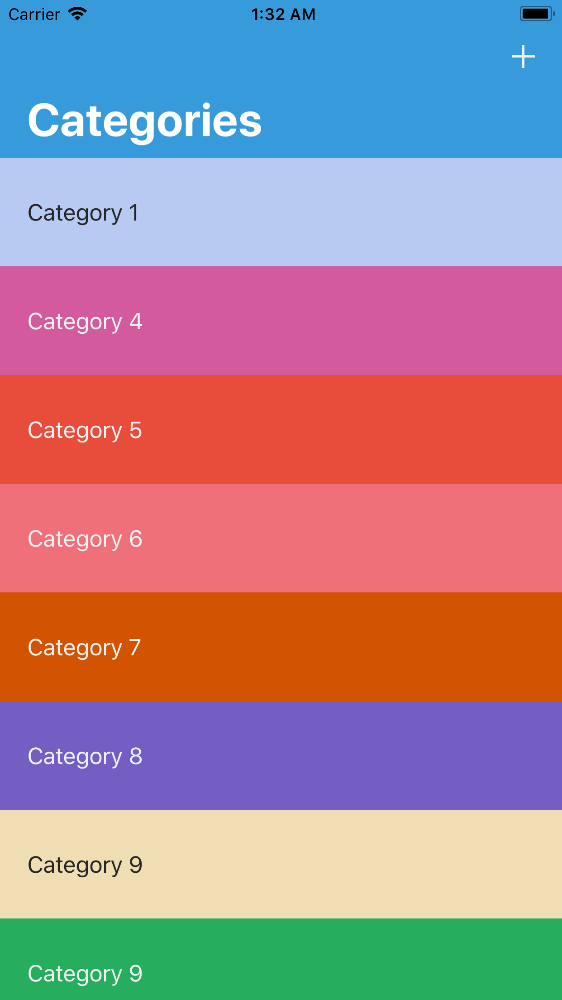  | 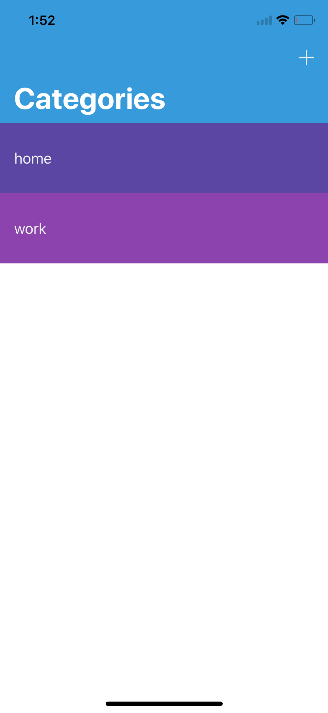
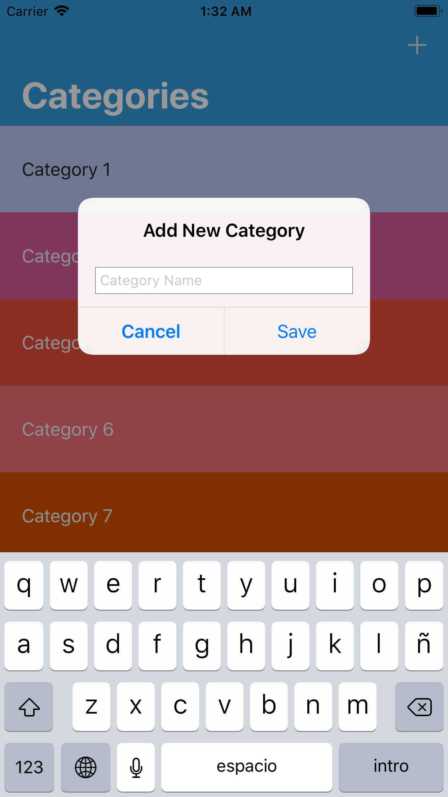 | 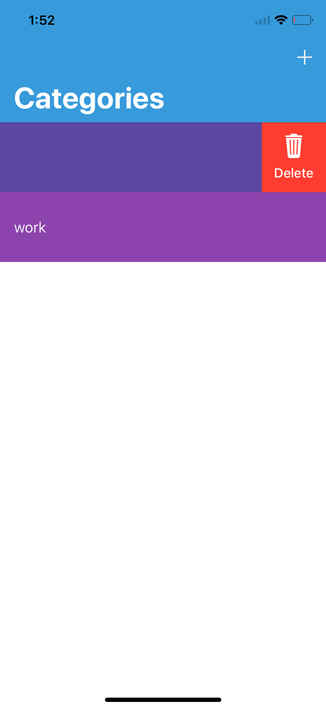
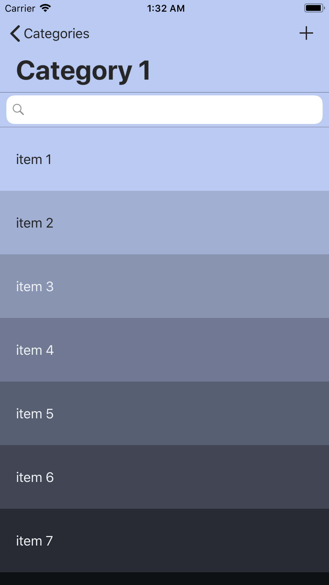    | 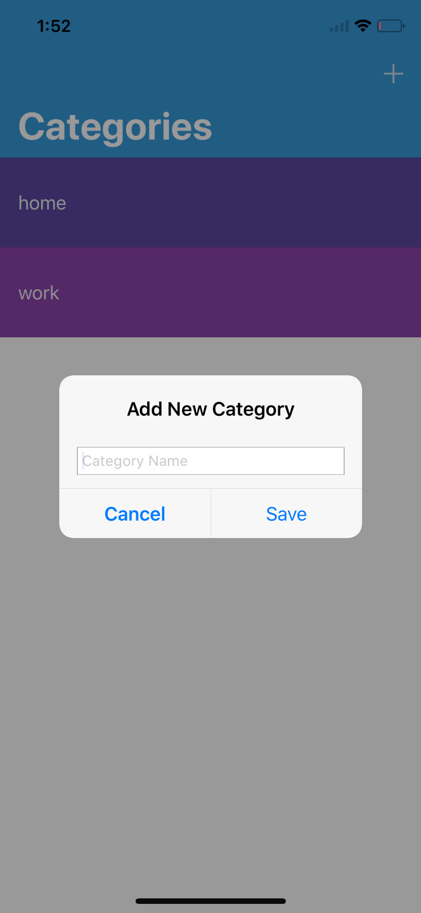
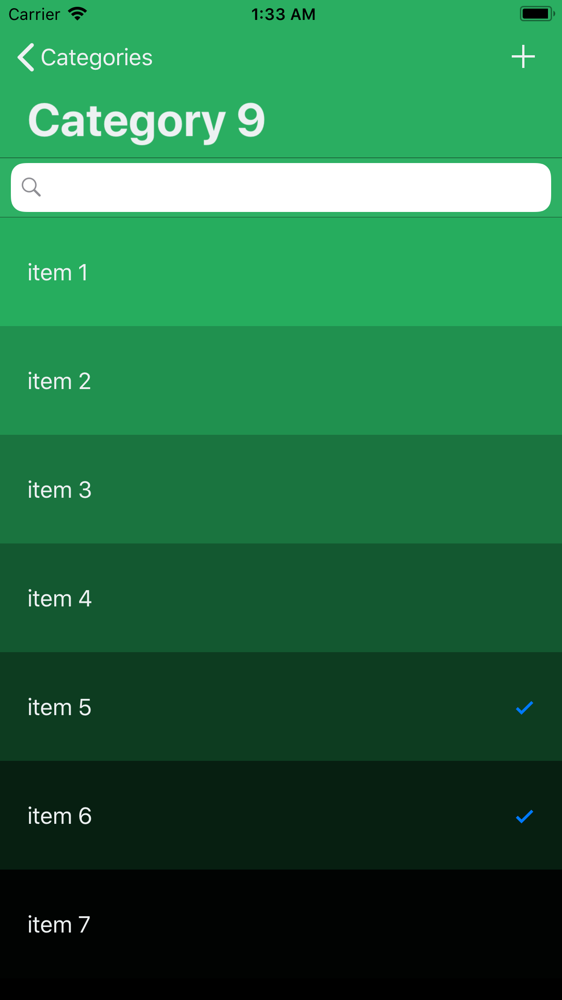   | 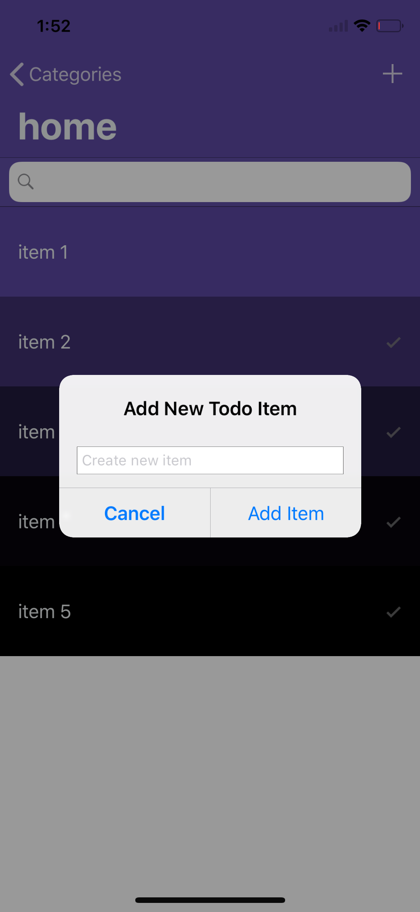
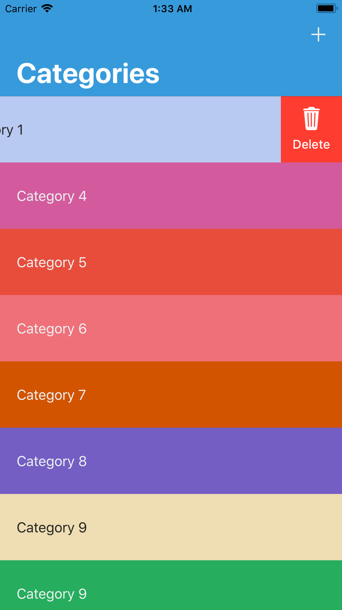   | 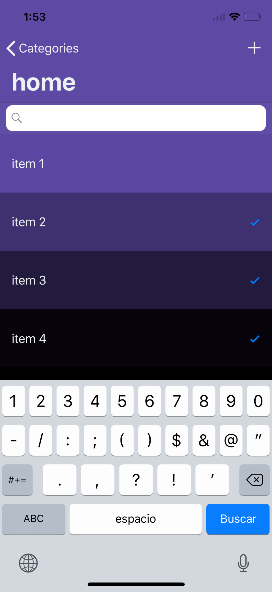
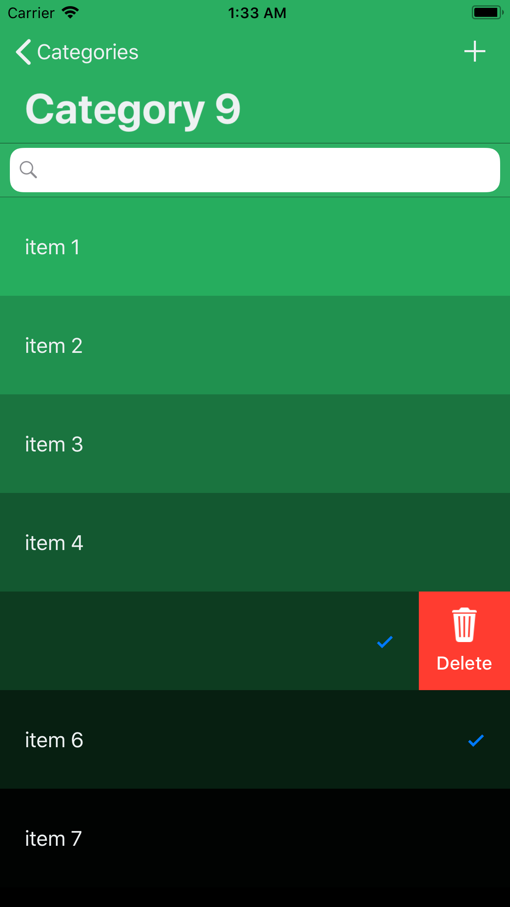   | 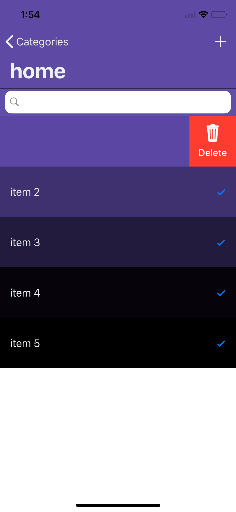

## Requirements

- iOS 8.0+
- Xcode 9
- Swift 4
- Cocoapods 1.3.+

## Meta

Jonathan Guillermo – hernandezmarquina@gmail.com

Distributed under the MIT license.

[Github - hernandezmarquina](https://github.com/hernandezmarquina)
